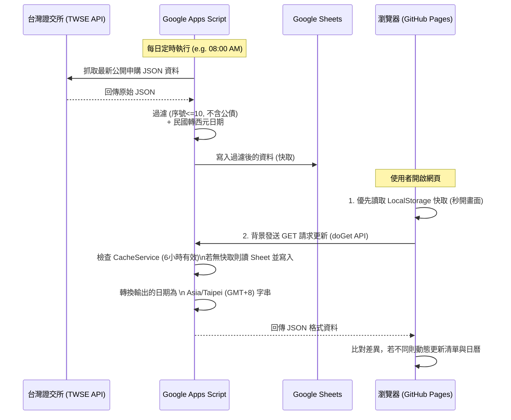

# Lucky Draw Calendar (TWSE 股票抽籤日曆)

## 1. 專案標題與簡介 (Title & Introduction)
**Lucky Draw Calendar** 是一個專為台灣股市（TWSE）設計的「新股抽籤（申購）時程視覺化」網頁應用程式。
透過串接台灣證券交易所的公開資料，此專案將原本條列式的抽籤資訊轉換為直覺的日曆介面，幫助投資人輕鬆掌握各檔股票的申購時程（含 T-1 日、T 日、T+1 日），並能自動計算每日所需的申購總金額，是資金調度與抽籤日程管理的實用工具。

## 2. 專案展示 (Demo)
🔗 **Live Demo**: [https://randchen.github.io/LuckyDrawCalendar/](https://randchen.github.io/LuckyDrawCalendar/)

> 💡 *這是一個靜態網頁搭配 Google Apps Script 作為後端 API 的無伺服器架構應用。*

## 3. 功能介紹 (Features)
* 📅 **直覺的日曆視圖 (Calendar View)**: 支援「月 (Month)」與「週 (Week)」視圖切換，清晰呈現股票抽籤的相關時程。
* ☑️ **多標的勾選 (Multi-Selection)**: 使用者可於側邊欄勾選近期開放抽籤的股票，日曆將即時更新對應的事件。
* 🕒 **營業日精準計算 (Business Day Calculation)**: 系統會自動扣除週六、週日等非營業日，精準標示從 T-1 日（扣款前一日）到 T+1 日（解鎖日）的資金佔用區間（亦可選擇隱藏週末顯示）。
* 💰 **自動資金加總 (Funding Calculation)**: 依據選取的股票，系統會自動在日曆上的對應日期加總並標示出當日所需的總申購金額，幫助投資人進行資金控管。
* 🚀 **極速讀取快取 (Dual Caching)**: 後端整合 GAS `CacheService` 記憶體快取以縮短 API 回覆時間，前端整合 `localStorage` 達成第二次載入「0 毫秒延遲」的秒開體驗。
* 🎨 **明亮現代化介面 (Light Mode RWD UI)**: 採用乾淨優雅的 Light Mode 與 Glassmorphism（毛玻璃）風格設計，並完全支援行動裝置視圖與觸控操作。

## 4. 技術棧 (Tech Stack)
### 前端 (Frontend)
*   **HTML5 / CSS3 / JavaScript (ES6)**: 原生語法構建，無重度框架負擔。
*   **[FullCalendar](https://fullcalendar.io/)**: 核心日曆渲染庫，處理複雜的日期顯示與事件排程。
*   **Google Fonts (Outfit)**: 提供高質感的現代英文字體。

### 後端 / 資料庫 (Backend & Data Layer)
*   **Google Apps Script (GAS)**: 擔任中介 API 角色，負責抓取、過濾與格式化外網資料。
*   **Google Sheets**: 作為輕量級的資料庫緩存，儲存已解析的股票抽籤資訊。

### 部署與代管 (Deployment)
*   **GitHub Pages**: 免費且高可用性的靜態網頁代管服務。

## 5. 系統架構圖 (Architecture)
以下流程圖展現了資料如何從台灣證券交易所流向使用者的瀏覽器：



## 6. 安裝與開發 (Setup & Installation)

若您希望在本地端運行或修改此專案，請參考以下步驟：

### 前端本地開發
1.  **Clone 專案**
    ```bash
    git clone https://github.com/RandChen/LuckyDrawCalendar.git
    cd LuckyDrawCalendar
    ```
2.  **開啟專案**
    由於這是一個純靜態的前端專案，您可以直接在瀏覽器中開啟 `index.html`，或是使用 VS Code 的 **Live Server** 擴充功能來啟動本地伺服器。

### 後端 (Google Apps Script) 部署
若您想要自行架設 API 服務：
1. 建立一個新的 Google Sheet，並開啟 **擴充功能 > Apps Script**。
2. 將專案中的 `Code.gs` 內容複製貼上至 Apps Script 編輯器中。
3. 將 `Code.gs` 頂部的 `SHEET_URL` 常數替換為您剛剛建立的 Google Sheet 網址。
4. 點擊 **部署 > 新增部署 > 網頁應用程式 (Web App)**。
   * 將存取權限設為 **"所有人 (Anyone)"**。
   * 複製產生的 **網頁應用程式 URL**。
5. 設定 **觸發條件 (Triggers)**，讓 `fetchAndFilterStockInfo` 函式每日自動執行一次（例如設定在早上 8 點）。
6. 回到前端專案的 `script.js`，將 `gasAPIUrl` 變數替換為您在步驟 4 取得的 URL。

## 7. 資料來源 (Data Source)
*   **台灣證券交易所 (TWSE) 提供給一般投資人之公開申購查詢 API**
    *   Endpoint: `https://www.twse.com.tw/rwd/zh/announcement/publicForm?response=JSON`
